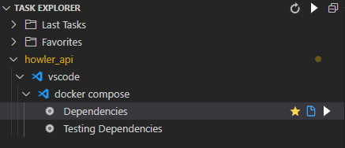

# Instructions d'installation

## Dépendances

Afin d'exécuter howler, vous avez besoin de :

- Python 3.9
- Docker
- Docker Compose
- Recommandé : Visual Studio Code

## Configurer les dossiers Howler

```bash
sudo mkdir -p /etc/howler/conf
sudo mkdir -p /var/cache/howler
sudo mkdir -p /var/lib/howler
sudo mkdir -p /var/log/howler

sudo chown -R $USER /etc/howler
sudo chown $USER /var/cache/howler
sudo chown $USER /var/lib/howler
sudo chown $USER /var/log/howler
```

## Configurer les dépendances APT

```bash
sudo apt update
sudo apt install -yy software-properties-common
sudo add-apt-repository -y ppa:deadsnakes/ppa
sudo apt install -yy python3-venv python3.9 python3.9-dev python3.9-venv
sudo apt install -yy libsasl2-2 build-essential libsasl2-dev libssl-dev zip
```

## Créez votre virtualenv

```bash
cd ~/repos/howler-api
python3.9 -m venv env
. env/bin/activate
pip install -U pip
pip install -U wheel
pip install python-dotenv
pip install -e .
```

## Mise en place des fichiers de configuration par défaut

Créer les fichiers classification.yml et config.yml par défaut :

```bash
. env/bin/activate
./generate_howler_conf.sh
```

## Configurer l'environnement par défaut

```bash
    cd ~/repos/howler-api
    echo "EXTERNAL_IP=`nom d'hôte -I | awk '{print $1}'`" > dev/.env
```

## Exécution de l'environnement de développement (VS Code)

Maintenant que les instructions d'installation sont terminées, vous pouvez charger votre dossier `howler-api`. Nous vous conseillons fortement d'installer les extensions recommandées lorsque vous y êtes invité ou lorsque vous tapez '@recommended' dans l'onglet Extensions.

### Lancer les conteneurs de dépendances

Vous pouvez lancer les conteneurs de dépendances soit manuellement dans un shell :

```bash
(cd ~/repos/howler-api/dev && docker-compose up)
```

Soit directement dans VSCode en utilisant les tâches dans l'explorateur de tâches



### Lancer l'API

Une fois les dépendances lancées, vous pouvez démarrer le serveur API. Le serveur API sera chargé avec la configuration par défaut trouvée dans votre dossier `/etc/howler/conf` que nous avons créé pendant l'installation. Donc si vous voulez activer/désactiver une fonctionnalité, faites-le à cet endroit.

Pour lancer le serveur API manuellement, vous pouvez utiliser cette commande :

```bash
cd ~/repos/howler-api
. env/bin/activate
python howler/app.py
```

Lancer l'API Server manuellement ne vous donne malheureusement pas accès à un débogueur. Si vous souhaitez pouvoir déboguer votre code, vous pouvez utiliser la cible de lancement prédéfinie à l'intérieur de VSCode :


## Exécution des tests

Afin d'exécuter les tests, démarrez les dépendances et lancez l'API, puis utilisez pytest :

```bash
# Installer les dépendances des tests
pip install -r test/requirements.txt

# Générer des listes de contrôle mitre
python howler/external/generate_mitre.py /etc/howler/lookups
